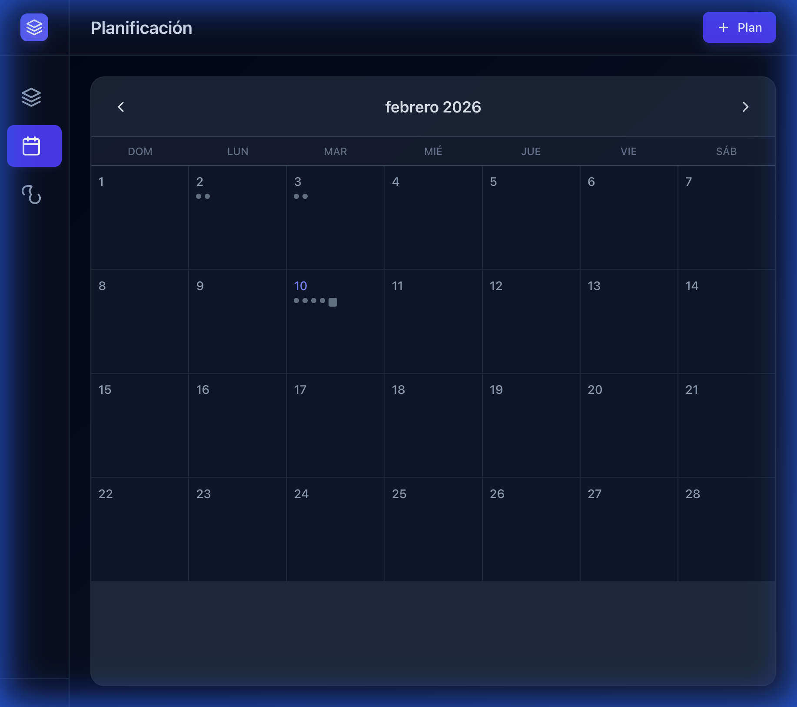
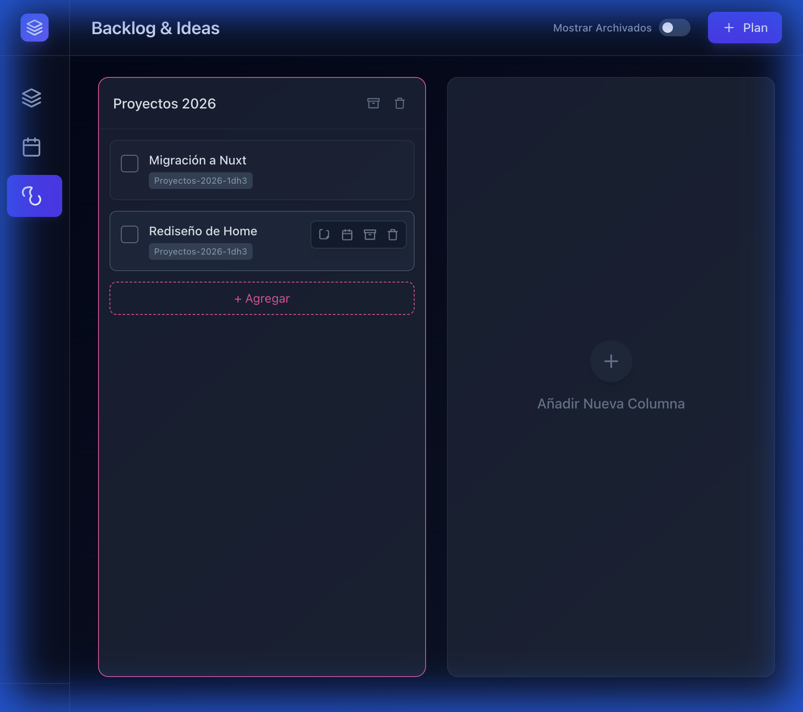
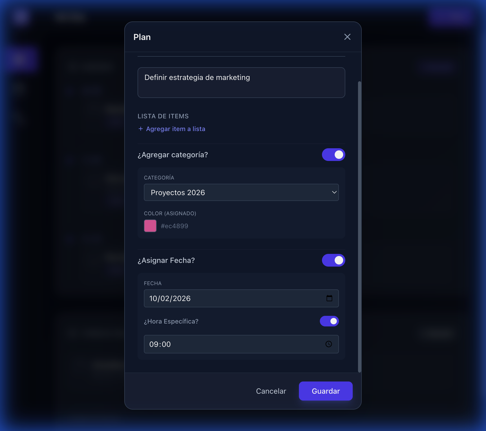

# Forward 🚀

**Forward** es una aplicación moderna de gestión de tareas y agenda diseñada para maximizar tu productividad diaria. Combina una lista de pendientes tradicional con una agenda estructurada y un tablero de backlog (atemporal) para capturar todas tus ideas.


## 🌟 Características Principales

### 1. Enfoque Diario (Mi Día) 🎯
La vista principal te ayuda a gestionar tu día actual con dos secciones claras:
- **Agenda (Con Hora)**: Visualiza tus compromisos y tareas con horario específico en una línea de tiempo vertical.
- **Tareas del Día (To-Do)**: Una lista flexible para tareas que deben hacerse hoy pero sin horario fijo.

### 2. Planificación Mensual (Calendario) 📅
- Una vista de calendario completa para organizar tu mes.
- Visualiza la carga de trabajo diaria con indicadores de tareas pendientes (puntos) y completadas (cuadros).
- Navegación fluida entre meses y acceso rápido al detalle de cualquier día.



### 3. Gestión Atemporal (Backlog & Ideas) ♾️
Un espacio dedicado para todo lo que no tiene fecha específica:
- **Columnas Personalizables**: Crea categorías como "Ideas", "Trabajo", "Proyectos Personales", etc.
- **Flujo de Trabajo Flexible**: Mueve tareas desde el backlog a tu agenda diaria cuando estés listo para ejecutarlas.
- **Archivo**: Mantén tu tablero limpio archivando columnas o tareas completadas sin perder el historial.



### 4. Creación Potente de Tareas ✨
Un modal intuitivo para capturar tareas con todo detalle:
- **Checklists**: Divide tareas grandes en sub-items manejables.
- **Categorización**: Asigna colores y categorías para organización visual.
- **Fechas y Horas**: Programa tareas para un día específico o déjalas en el backlog.



## 🛠️ Tecnologías

Este proyecto está construido con un stack moderno y eficiente:

- **Frontend**: [Vue.js 3](https://vuejs.org/) (Composition API)
- **Build Tool**: [Vite](https://vitejs.dev/) - Para un desarrollo ultrarrápido.
- **Estilos**: [Tailwind CSS](https://tailwindcss.com/) - Diseño responsivo y personalizable.
- **Estado**: [Pinia](https://pinia.vuejs.org/) - Gestión de estado reactiva.
- **Backend / Persistencia**: [Firebase](https://firebase.google.com/) (Firestore) - Almacenamiento de datos en tiempo real.

## 🚀 Instalación y Ejecución

Sigue estos pasos para correr el proyecto localmente:

1.  **Clonar el repositorio:**
    ```bash
    git clone <tu-repositorio>
    cd forward
    ```

2.  **Instalar dependencias:**
    ```bash
    npm install
    ```

3.  **Configurar Variables de Entorno:**
    Asegúrate de tener configurado tu proyecto de Firebase. Crea un archivo `.env` en la raíz si es necesario (consulta `.env.example`).

4.  **Iniciar servidor de desarrollo:**
    ```bash
    npm run dev
    ```
    La aplicación estará disponible en `http://localhost:5173` (o el puerto que indique la consola).

## 🚧 Estado del Proyecto

Actualmente, el **Frontend** está completo con todas las funcionalidades lógicas y de interfaz de usuario.
- ✅ Gestión completa de tareas (CRUD).
- ✅ Vistas de Día, Calendario y Backlog.
- ✅ Persistencia de datos con Firebase.

**Pendiente:**
- 🔄 Backend dedicado para sistema de notificaciones push (Móvil/Escritorio).

---
*Hecho con ❤️ para organizar tu vida.*
